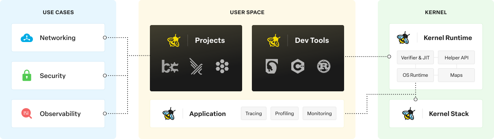

# **eBPF: Revolution or Illusion**

Exploring the Reality Behind the Technology and Unraveling its Mysteries in 15 Minutes.

---

# Extendend Berkeley Packet Filter

### What is eBPF?

- eBPF is a revolutionary in-kernel virtual machine that enables safe and efficient programmability of the Linux kernel.

---

# Extendend Berkeley Packet Filter

### What is really eBPF?

- It allows dynamic and customizable packet filtering, tracing, and in-kernel programmability without the need for kernel module changes

---

# Diagram

---

# DEMO TIME 

---
# Conclusion

eBPF is not just hype; it's a transformative technology shaping the future of Linux kernel programmability.

---

# Links

- https://www.youtube.com/watch?v=Wb_vD3XZYOA
- https://ebpf.io/
