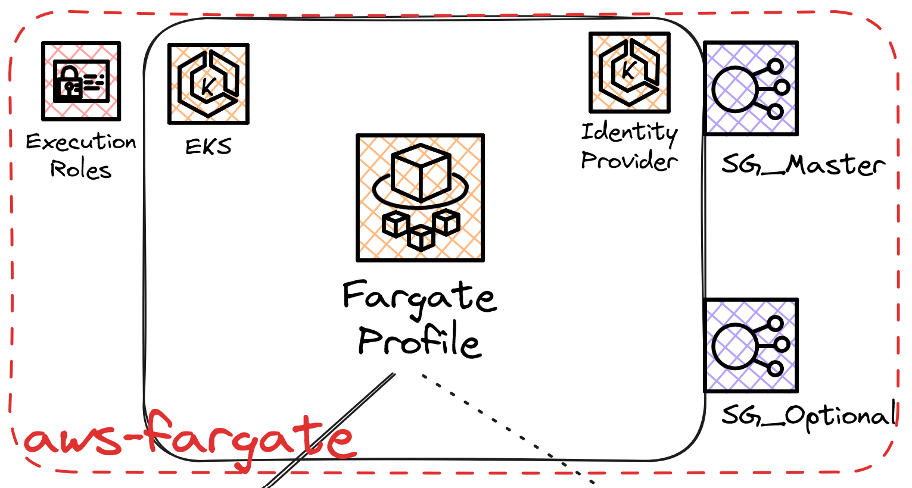
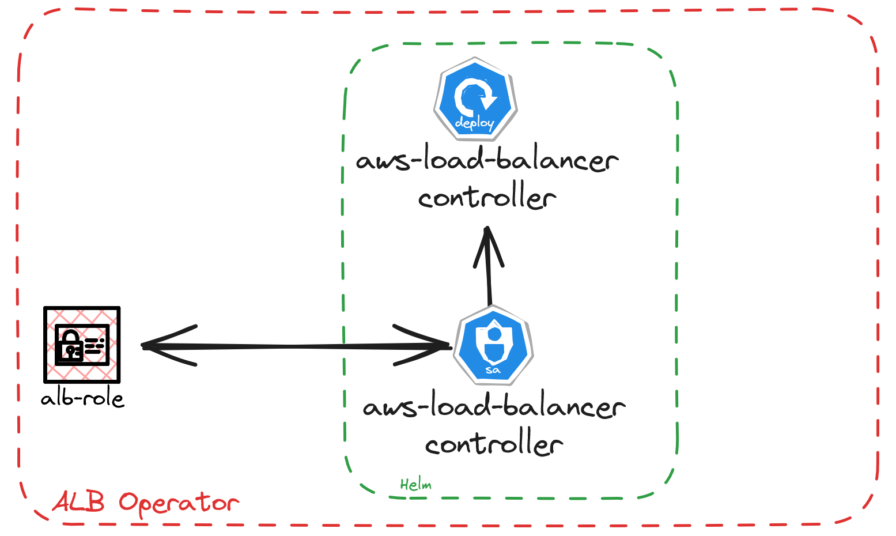

# EKS Fargate Isolate Cluster

---

# Agenda

- Terraform Module
- EKS Fargate
- Addons (vpc-cni, coredns, kube-proxy)
- ALB Operator
- QA

---

# Terraform Module

- Simple
- Flexible
- Evolucionable

---

# EKS Fargate



---

# EKS Fargate

- 1 Pod -> 1 Node
- Node isolation, you can't run DaemonSets,StatefulSets
- You can't talk with pods directly
- You can't use EBS volumes
- Privileged containers are not allowed
- Out the Box you cant use Horizontal Pod Autoscaler (cluster-metrics)

---

# Addons

#### VPC CNI 

CNI Network management

Missing Features:

- Network Policies

---
# Addons
#### CoreDNS

Manage DNS service into all  cluster

## kube-proxy

It's use to comunicate pod with masters

---

# ALB Operator



---

# Deploy ALB

```yaml
apiVersion: networking.k8s.io/v1
kind: Ingress
---more---
annotations:
  alb.ingress.kubernetes.io/scheme: internet-facing
  alb.ingress.kubernetes.io/tags: Environment=dev,Team=test
spec:
  ingressClassName: alb
  rules:
```

docs: https://kubernetes-sigs.github.io/aws-load-balancer-controller/v2.6/guide/ingress/annotations/

---

# Deploy ALB

- 2 types to deploy:
    - internet-facing => public subnets
    - internal => app subnets

Autodiscover subnets by tags into subnets.
