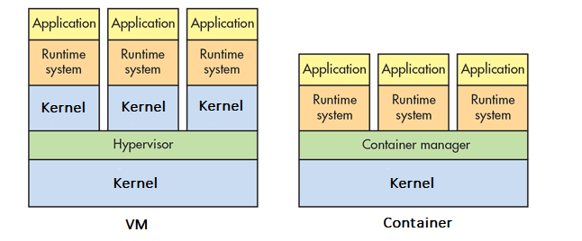
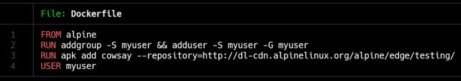
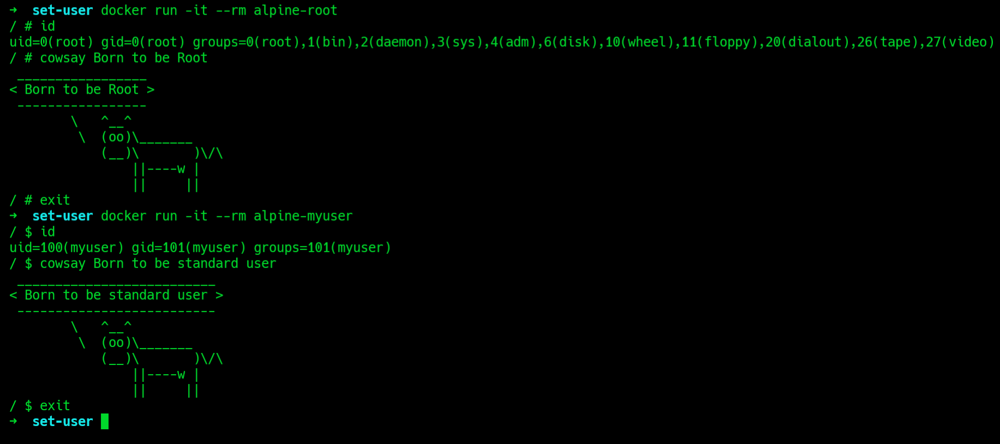
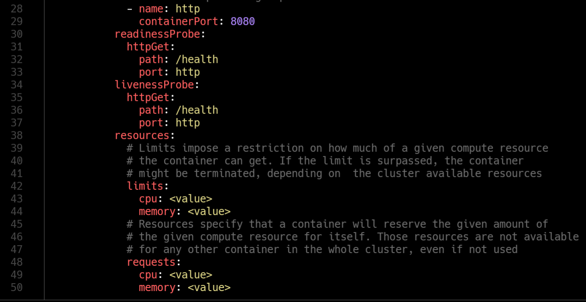
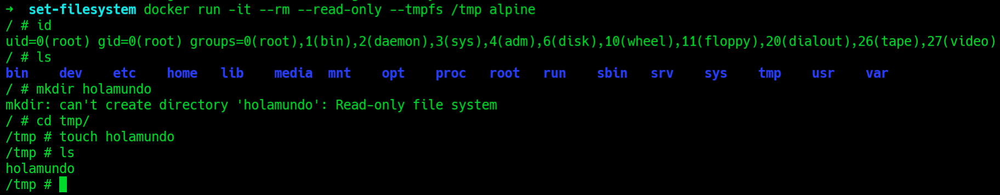
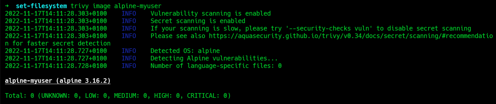
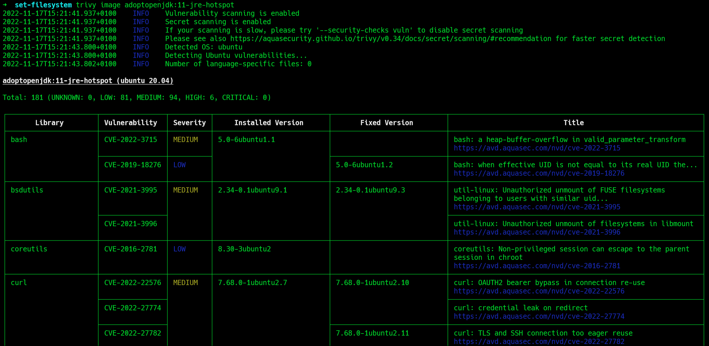

# <!--fit--> Born to be Root

How we can protect our Infrastructure

<!-- Esto hace referencia a nuestra  -->

---
### Architecture of Docker

Share kernel Host

---
#### 0 - Keep Host and Docker up to date

---
#### 1 - Set a user

---

---
#### 2 - Limit resources

---
#### 3 - Set filesystem and volumes to read-only

---
#### 4 - Use static analysis tools

---

---
#### 5 - Lint the Dockerfile at build time

---

## Demo Time
---
#### Review 
* Keep Host and Docker up to date
* Set a user
* Limit resources
* Set filesystem and volumes to read-only
* Use static analysis tools
* Lint the Dockerfile at build time

---

Thanks!  👋